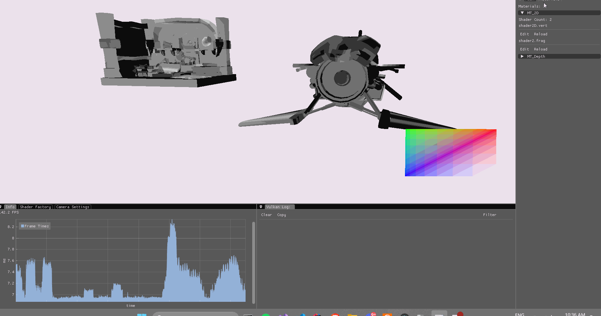

# VulkanPlayground

## Some Features
- Hot Shader Reloading
- PBR Material System (Channel and non channel packed)
- Runtime GLTF/Obj Model Loading
- Runtime Texture Loading/Swapping (including .ktx textures)
- Compute Shaders
- Compute SSAO
- Linux & Windows Support

## What did i want to get out of this project?
First of all i want to setup a working runtime shader editor and abstract vulkan. 
This is used as my shader editor to quickly prototype and test Graphics Programming Techniques 

